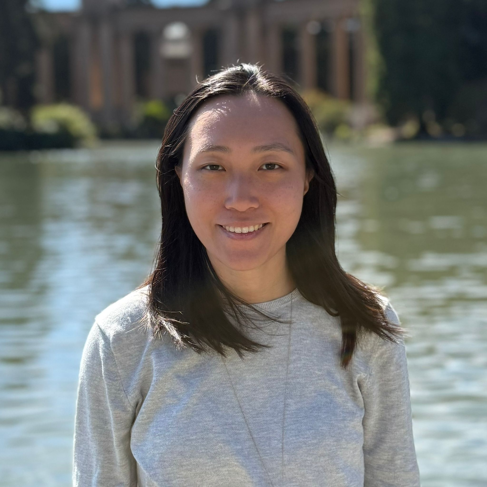

# Welcome!

I am a fourth-year PhD candidate in the UC Berkeley Psychology Department advised by Fei Xu. My research focuses on infants' and young children's conceptual development and probabilistic reasoning.

Email: [alyson_wong@berkeley.edu](mailto:alyson_wong@berkeley.edu)
